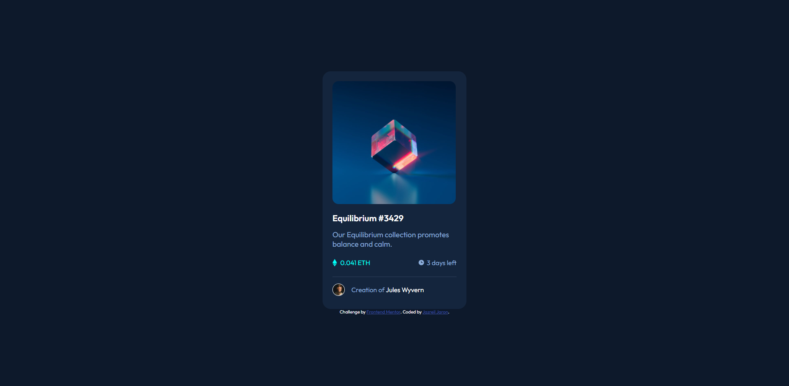
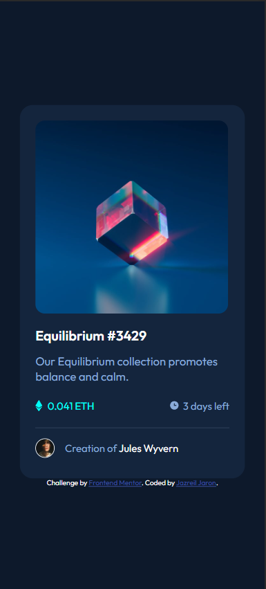

# Frontend Mentor - NFT preview card component solution

This is a solution to the [NFT preview card component challenge on Frontend Mentor](https://www.frontendmentor.io/challenges/nft-preview-card-component-SbdUL_w0U). Frontend Mentor challenges help you improve your coding skills by building realistic projects. 

## Table of contents

- [Frontend Mentor - NFT preview card component solution](#frontend-mentor---nft-preview-card-component-solution)
  - [Table of contents](#table-of-contents)
  - [Overview](#overview)
    - [The challenge](#the-challenge)
    - [Screenshot](#screenshot)
      - [Desktop View](#desktop-view)
      - [Mobile View](#mobile-view)
    - [Links](#links)
  - [My process](#my-process)
    - [Built with](#built-with)
    - [What I learned](#what-i-learned)
    - [Useful resources](#useful-resources)
  - [Author](#author)


## Overview

### The challenge

Users should be able to:

- View the optimal layout depending on their device's screen size
- See hover states for interactive elements

### Screenshot

#### Desktop View


#### Mobile View


### Links

- Solution URL: [https://github.com/Atlas-jjs/nft-preview-card]
- Live Site URL: [https://atlas-jjs.github.io/nft-preview-card/]

## My process

### Built with

- Semantic HTML5 markup
- CSS custom properties
- Flexbox
- CSS Grid

### What I learned

- I had to build another layer that will act as a overlay.
- Instead of adjusting the opacity of the overlay layer, I instead use the RGBA so I could adjust its opacity itself without affecting the svg inside which is the view icon.
```
.container .image .image-overlay {
    z-index: 1;
    background: hsl(178, 100%, 50%, 50%);
    position: absolute;
    top: 0;
    height: 99%;
    width: 100%;
    opacity: 0;
    border-radius: 15px;
    transition: 0.5s ease;
    cursor: pointer;
}
```
- This will center the view icon.
```
.container .image .image-overlay img {
    position: absolute;
    top: 50%;
    left: 50%;;
    transform: translate(-50%, -50%);
}
```

### Useful resources

- [Overlay Layer](https://www.youtube.com/watch?v=88aBN3N45WA&list=LL&index=1&ab_channel=CodeAgam) - I based the code for the overlay layer on this video which was extremely useful.

## Author

- Website - [Jazreil Jaron](https://www.frontendmentor.io/profile/Atlas-jjs)
- Frontend Mentor - [@Atlas.jjs](https://www.frontendmentor.io/profile/Atlas-jjs)